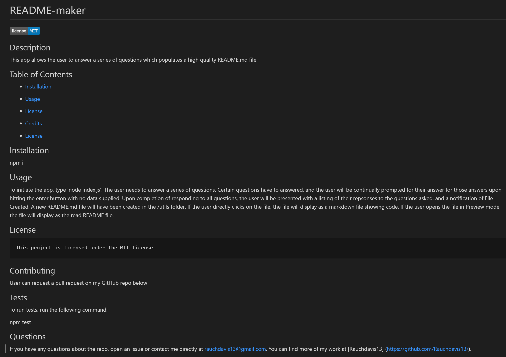

# README-maker

## Bootcamp: Challenge 9 - Create app for README.md

The purpose of this assignment, is to create a working app for a user to populate a template to build a README.md file through a series of questions asked.

- Motivation: Test what has been learned through practical application and testing of Javascript, Node and Node modules including "inquirer", related to the construct of this assignment

- Project: Create an app to create a README.md file.  The file will be filled with answers from user promtps for GitHub ID, email, project name, project description, license used (if any), command instructions for dependencies and tests, and user supplied instructions for 3rd party usage and contribution.

- Problem Solved: User is prompted to answer a series of questions from the command prompt and a README.md file is generated.  In addition, a video is supplied from the author that walks a user through the process of using this app.

- Lessons Learned: Many. The course work in Module 9 supplied a good frame work of how to make the main js file (index.js) using inquirer questions/answers, as well as how to use promise statements for sending data to other files in the app for specific functions.  However, Module 9 used inquire.prompt differently than this assignment requires, in that Module 9 had one main array for a first series of user questions, then an additional array for a user to enter in multiple projects.  This project required only one array of questions.  The remaining data flow and file creation was similar.   The syntax of the "promise" process is tricky and needs repetition for better understanding of how this flow works, and to reduce/prevent syntax errors in usage.  As this was on the main core teachings in this latest module, it was easy to get stuck with incorrect syntax preventing data flow from one file to the next.  Be careful on usage of console.log statements within the .then statements, as it's easy to get errors and prevent data flow.  When the README.md file is generated, the file is written as a markdown template where temperate literals and links are visible.  To view it as a "readme" file, it must be viewed in preview mode.

## Files

- README.md:  Explains usage and functionality of this app

- redme-guide.md:  Contains recommendations on preferred README.md information

- gitignore: Contains files names that are not passed to Github for usage with the app

- package-lock.json: Package of Node modules, including "inquirer"

- package.json:  Node module file

- index.js: This is where the app begins.  It brings in the "inquirer" node to facilitate a question / answer array by using "require, as well as "require"ing the path of the generateMarkdown.js file.  The "answers" or answerData, is console logged for the viewer to see the data they supplied and then sent to the generateMarkdown.js file via writeFile.

- generateMarkdown.js: Located in the /utils folder, the file starts with a series of 3 functions to
```
 1.) If the licence question from index.js does not equal "none", then bring in the license badge
 2.) If the license question from index.js does not equal "none", then bring in the license link
 3.) If the license question from index.js does not equal "none", then return the license section of README
 ``` 
 The data from index.js is fed to the various temperate literals to populate these fields when the README.md is created.

- createMarkdown.js: Located in the /utils folder, this file takes the writeFile(generateMarkdown) info and writes the README.md file.  Upon completion, there is a command line message indicating a successful completion

- /output folder:  This is where the created README.md file will be contained

- /images: Holds images used for examples shown in this file's README.md

## Acceptance Criteria

All criteria have been met

- WHEN I am prompted for information about my application repository / THEN a high-quality, professional README.md is generated with the title of my project and sections entitled Description, Table of Contents, Installation, Usage, License, Contributing, Tests, and Questions: 

- WHEN I enter my project title / THEN this is displayed as the title of the README: The user supplied project title is generated as the title for the README.md file.

- WHEN I enter a description, installation instructions, usage information, contribution guidelines, and test instructions / THEN this information is added to the sections of the README entitled Description, Installation, Usage, Contributing, and TestsColor: 

- WHEN I choose a license for my application from a list of options / THEN a badge for that license is added near the top of the README and a notice is added to the section of the README entitled License that explains which license the application is covered under: 
- WHEN I enter my GitHub username / THEN this is added to the section of the README entitiled Questions, with a ink to my GitHub profile: 

- WHEN I enter my email address / THEN this is added to the section of the README entitiled Questions, with instructions on how to reach me with additional questions: 

- WHEN I click on the links in the Table of Contents / THEN I am taken to the corresponding section of the README: 

### All criteria have been met

User prompted questions, which will populate the README file


Populated README.md file viewed in Preview



## GitHub repository...
https://github.com/RauchDavis13/README-maker.git

## Website...
https://rauchdavis13.github.io/README-maker/

## Video Link (Screencastify)
https://watch.screencastify.com/v/X5EZvwANwYm0RJO1bp48


## Thank you's
Matthew Kim(Instructor)
Valeria Flores(TA)
Dustin Erwin (TA)
Kris Renaldi (TA)
Sandra Smith (Tutor)

Fellow students...
Chris McCormack
Robert Evanic
K-Von Madison
Adam Howard
Edwared McCarthy


